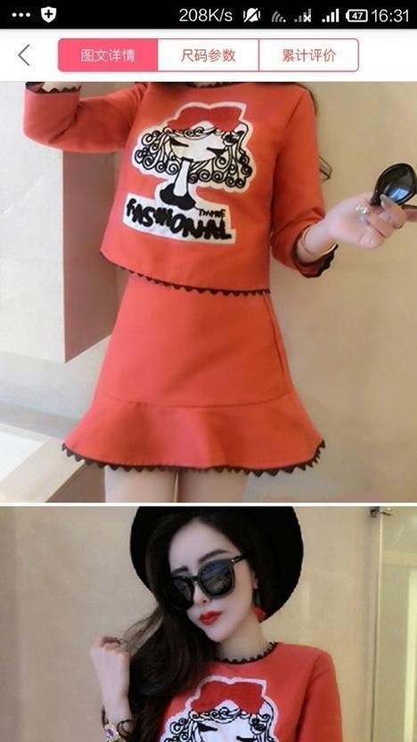

# Clothing Detection and Retrieval

## Objective

This is one of my personal projects. The goal is to detect the clothing items from user images. Once the precise location of the garment is predicted (bounding box and mask) in the image, the idea is to retrieve similar looking clothing items. The objective can be summarized by accommplishing following two tasks.

1. Perform Instance Segmentation to detect all present fashion accessories from the image.
2. Extract features from each detected item from previous step to recommend similar looking items from a large database of fashion images. Here, I plan to categorize this search task into three criterions. 
    - Color
    - Texture
    - Shape

    Feature extraction step will take into account all of the aforementioned properties of the object.

## Progress Made

So far, I have completed the first task from the above list. But yet to achieve the second objective.

## Implementation Details

### 1. Instance Segmentation

I have finetuned MaskRCNN architecture with Resnet-18 backbone network on the DeepFashion2 (DF2) Dataset [1]. Many Thanks to the authors of DF2 dataset for allowing me to download this dataset for this hobby project.

*I have adapted the reference scripts provided in the TorchVision v0.8.2 github repo [2] to achieve this task.*

[env.txt](./env.txt) contains conda virtual environment configs.

#### Dataset Specifications

- Train Size: 1,91,961
- Validation Size: 32,153
- Test Size: 62,629

- Types of clothing
    1. short sleeve top
    1. long sleeve top
    1. short sleeve outwear
    1. long sleeve outwear
    1. vest
    1. sling
    1. shorts
    1. trousers
    1. skirt
    1. short sleeve dress
    1. long sleeve dress
    1. vest dress
    1. sling dress

    *Resnet-18 is the smallest backbone network available for MaskRCNN at the time. Due to lack of resources, I'm using this backbone. To further reduce the size of the model, I have only performed binary classification meaning the detected clothing item isn't categorized into aforementioned 13 classes. Rather it gives just a number indicating the probability that the detected item is a fashion accessory. However, one can easily adapt the code to make it work with all 13 classes.*

- For more details take a look at [1] and [3].

#### Training Configurations

- MaskRCNN with Resnet-18 with trainable backbone layers set to 4 and maximum value being 5
- Batch size set to 4 and 32 workers to quickly prepare batches in parallel. The model was trained on two GPUs, each had 8 GB of VRAM, processing 8 samples at a time.
- Number of epochs: 10
- Optimizer: Stochastic Gradient Descent with learning rate of 0.005, momentum set to 0.9 and weight decay to 0.0001.
- MultiStep learning rate scheduler is used to reduce the learning rate after 2nd, 4th and 6th epoch by multiplying the current value with 0.1.

#### Files

- [train.py](./train.py) is the main file. Following the aforementioned configs, one can run it by executing the following line in the terminal,

    ```bash
    CUDA_VISIBLE_DEVICES=0,2 python -m torch.distributed.launch --nproc_per_node=2 --use_env train.py -b 4 -j 32 --world-size 2 --output-dir models_iter2 --lr 0.005 --trainable-backbone-layers 4 --epochs 10
    ```
- [dataset_helpers.py](./dataset_helpers.py) file contains code to prepare data for training.

- [data_aug.py](./data_aug.py) contains data augmentation classes written by me to augment the dataset during training by randomly flipping the image in horizontal direction and applying random affine transformation (rotation + translation + scaling + shear).

- Torchvision uses pycocotools package to calculate COCO performance metrics.

- [infer.py](./infer.py) script performs inference on random test data given the trained model's path and stores it in a directory. [draw_samples.py](./draw_samples.py) contains drawing functions.

- COCO dataset object for the validation dataset is pickled and stored in a file to avoid repeated conversions. [generate_val_to_coco_api.py](./generate_val_to_coco_api.py) is responsible for the same.

#### Results

- Best performance was achieved on the validation dataset at the end of epoch 5. The stats of the same are shown in [test_stats.txt](./test_stats.txt). This model achieved **0.682** mAP and **0.734** mAP *(@ 0.5 : 0.95 : 0.05)* on the bounding box detection and mask detection task respectively on the validation dataset.

- This model was used to predict clothing items on the random **test dataset** samples. The results of the same are shown below.

| Input Image | Predictions |
| --- | ----------- |
|  |  |
|  |  |
|  |  |
|  |  |
|  |  |
|  |  |
|  |  |
|  |  |
|  |  |
|  |  |
|  |  |
|  |  |
|  |  |
|  |  |


## References

1. Y. Ge, R. Zhang, X. Wang, X. Tang and P. Luo, "DeepFashion2: A Versatile Benchmark for Detection, Pose Estimation, Segmentation and Re-Identification of Clothing Images," 2019 IEEE/CVF Conference on Computer Vision and Pattern Recognition (CVPR), Long Beach, CA, USA, 2019, pp. 5332-5340, doi: 10.1109/CVPR.2019.00548.
2. Torchvision v0.8.2 References, https://github.com/pytorch/vision/tree/v0.8.2/references/detection
3. DeepFashion2 Github, https://github.com/switchablenorms/DeepFashion2


