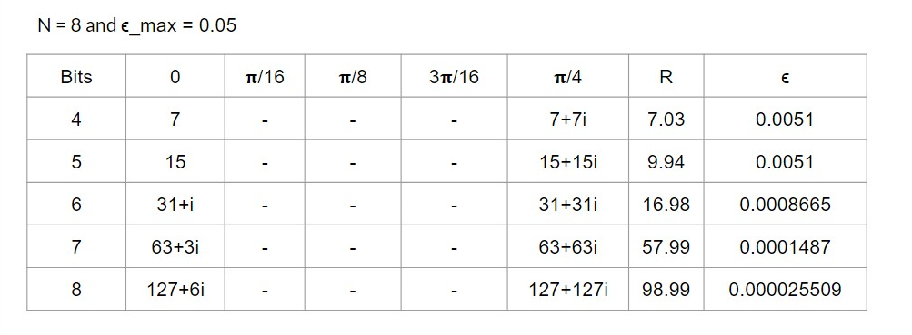
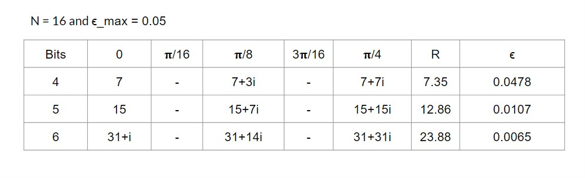

## Digital Signal Processing Project

Goal was to reproduce results of research paper (**low_complexity_multiplierless_rotators_july2014.pdf**). Only results regarding *coefficient selection for SCR (Single Constant Rotation) and MCR (Multiple Constant Rotations)* has to be generated. 

One needs to read following parts only from research paper,
* Abstract
* Introduction
* Rotations in fixed point arithmetic
* Design Process in Proposed multiplierless constant rotators

Results (**Rotation error only, shown as epsilon symbol**) to be reproduced are shown in table 7 (page 8) for 8 point FFT. Same is also displayed in table 1 (page 4) in **Reference-12 Accurate Rotations Based on Coefficient Scaling.pdf** (reference paper), for N = 8,16 and number of bits = 4,5,6,7,8

Run *proj_code.m*, comments are added for better readability.

Results that I produced are shown in following images, 

These rotation error values matches with values shown in table 1 (page 4) of **Reference-12 Accurate Rotations Based on Coefficient Scaling.pdf**
