# Feature Engineering for Person Identification given Dentition Images

## Objective

Given a dataset of dentition images of various individuals, extract features from them to uniquely identify a person using only Image Processing techniques. Kindly refer to the [report](./feature_extraction_dentition_images.pdf) for more details.

## Overview

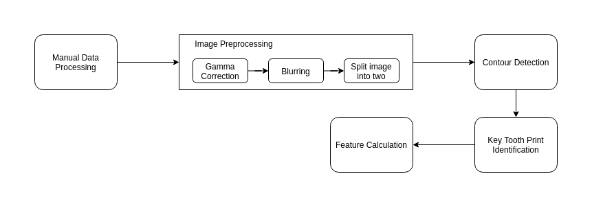

1. Input Image

    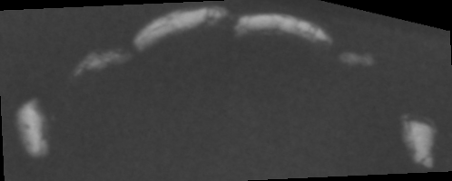

2. Gamma correction

    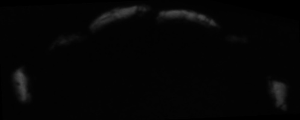

3. Blurring

    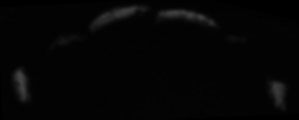

4. Left

    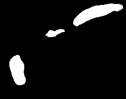
    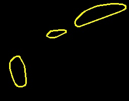

    Incisor

    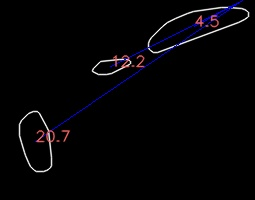

    Canine

    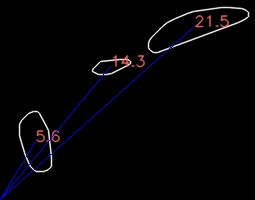

5. Right

    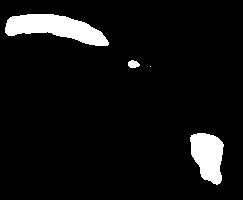
    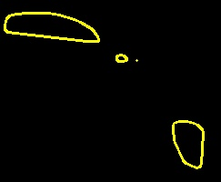

    Incisor

    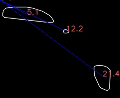

    Canine

    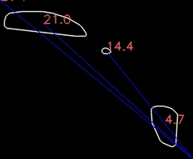

6. Incisor and Canine detection

    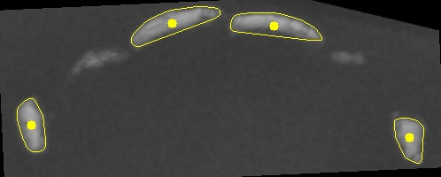

7. Feature Calculation

    - Angular Features

        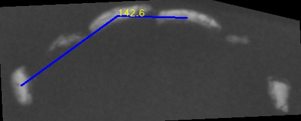
        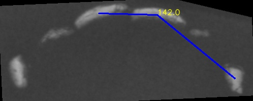
        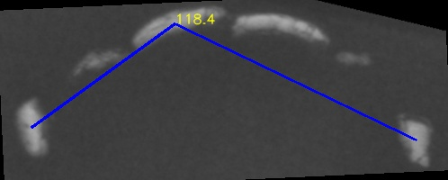
        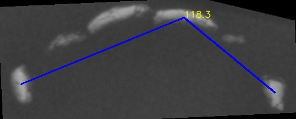
        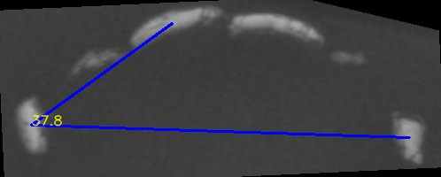
        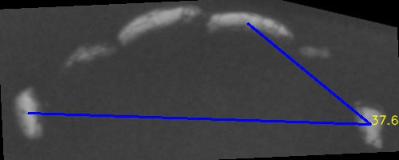

    - Distance related features

        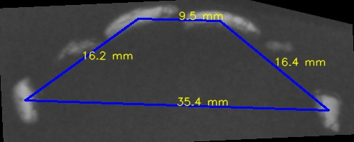
