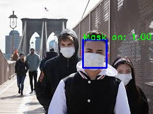
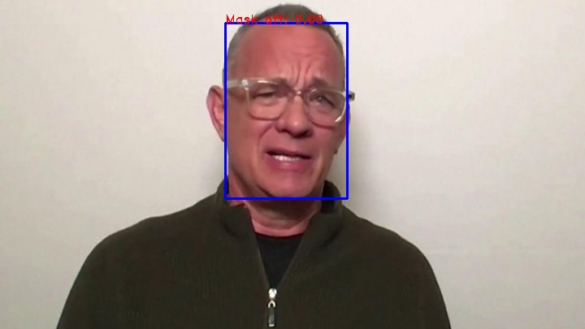
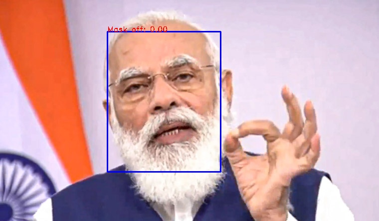
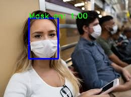

This was part of an assignment I was given in an interview. Detect if people are wearing mask given images.

I have finetuned mobilenet_v3 on [this](https://www.kaggle.com/ashishjangra27/face-mask-12k-images-dataset) dataset (available on kaggle). Refer to **mask-detection.ipynb** for finetuning code (Hopefully one will understand it :) just kidding. I have commented it). This model gives reasonably good performance even though only trained for *10* epochs.

*test .py* contains code for running inference on test images. See the results of some sample images below.

 

 

 

 

